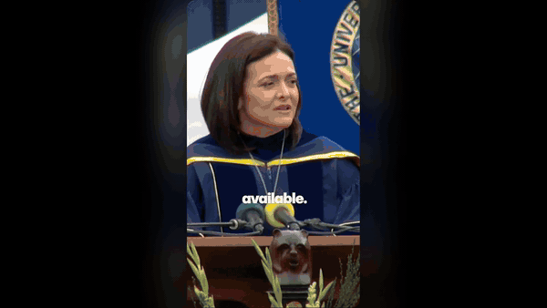
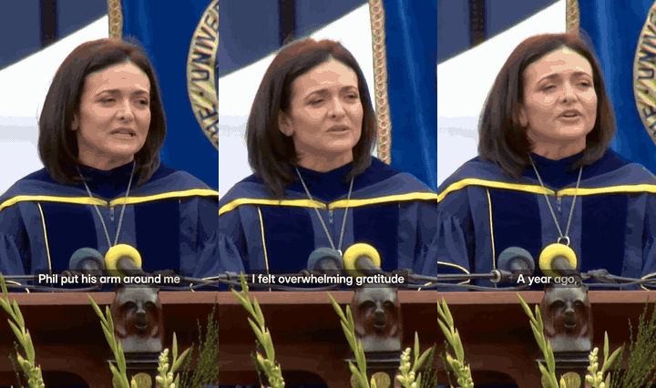
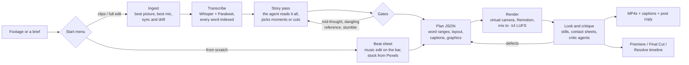
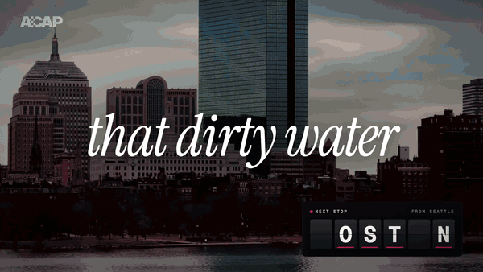

<div align="center">

# oneshot-video

**Your AI agent is now a video editor.**

Raw footage in: a finished edit, captioned clips for every platform, or a promo from a brief.<br>
Runs locally on your Mac. Hands the timeline back to Premiere Pro, Final Cut Pro and DaVinci Resolve.

[](LICENSE)
[](#requirements)
[](#install)
[](#install)



<sub>Made by oneshot-video itself, from the author's own talk: a 24-minute phone recording from the back of a ballroom became the 15-minute edit, the clips and this trailer. <a href="https://github.com/kvrancic/oneshot-video/releases/download/v1.0.0/trailer-720p.mp4">Watch it with sound</a> · <a href="skills/oneshot-video/examples/trailer">its source</a></sub>

</div>

```text
> Use oneshot-video on ~/Movies/keynote/

  What should I make?
  ❯ Full edit + clips   the whole talk cut tight, then the best moments as shorts   (recommended: 3 cameras, 52 min)
    Full edit           fillers and dead air out, best angle, titles, chapters, subtitles
    Clips               standalone 9:16 and 16:9 clips with captions and graphics
    From scratch        a promo or opener from a brief, with stock footage and motion graphics

  Hand it back as?  [x] Finished MP4s  [x] Premiere Pro  [ ] Final Cut Pro (beta)  [ ] DaVinci Resolve (beta)
```

## What it makes

| | Mode | You give it | You get back |
|---|---|---|---|
| ✂️ | **Clips** | Any long video: a talk, a podcast, a stream, a finished edit | 3 to 6 clips that stand alone, cut on word boundaries, reframed to 9:16 by a virtual camera that follows the speaker, with word-timed captions, motion graphics, a loudness-correct mix, a cover, an .srt and post copy per platform |
| 🎬 | **Full edit** | A raw recording: one or more cameras, a mic, a screen recording | The whole talk cut tight: synced, fillers and restarts out, the best angle on every sentence, a matched grade, an opening title, chapters, subtitles, YouTube chapter timestamps |
| 🔁 | **Full edit + clips** | The same raw recording | Both, from one sync and one look |
| ✨ | **From scratch** | A brief, and maybe a logo, a song or one clip | A finished promo, opener or trailer: a story on the beat, Pexels stock footage, a music edit cut on the bar, motion graphics, mastered to -14 LUFS |

Full edits and from-scratch films can come back as a timeline in your editor, on your original media, so you finish the last 10 percent by hand.

<div align="center">

<br><sub>Big moments from five clips an agent picked, cut, reframed and finished from two 25-minute <a href="#credits">CC BY</a> talks, with no human input: takeovers, words behind the speaker, count-ups, punch-ins, a sound under every graphic.</sub>
</div>

## Install

**Claude Code** (plugin):

```bash
claude plugin marketplace add kvrancic/oneshot-video
claude plugin install oneshot-video@oneshot-video
```

<details>
<summary><b>Codex, Cursor, OpenCode, Gemini CLI, GitHub Copilot</b></summary>

```bash
npx skills add kvrancic/oneshot-video
```

Or clone it and link `skills/oneshot-video` into `~/.agents/skills`, which all of these agents read.

</details>

<details>
<summary><b>From a clone</b> (to hack on it)</summary>

```bash
git clone https://github.com/kvrancic/oneshot-video && cd oneshot-video
skills/oneshot-video/scripts/install.sh    # also links the skill into ~/.claude/skills and ~/.agents/skills
```

</details>

The first time you use it, the agent runs `doctor.sh` and offers to install what is missing: ffmpeg, whisper.cpp, a Python venv, the models (about 1 GB) and Remotion. Heavy files live in `~/.oneshot-video`, so updates take seconds.

Then just ask:

> Use oneshot-video on ~/Movies/podcast-ep12.mp4. Four clips for TikTok and LinkedIn, and one about the part where we argue about remote work.

> Edit my talk in ~/Movies/meetup/ (two cameras, a lavalier and a screen recording). Keep it tight, cut the live demo, give me a Premiere project.

> Make a 45-second opener for our conference. The next one is in Lisbon. Here's our logo and a song we licensed.

## How it works



The agent never types a timestamp. Every cut is a range of word indices, so it lands on a pause or a word boundary, never mid-word, and a re-cut is an edit to a small JSON plan that rebuilds only what changed. Gates reject clips that start on "so" or "and", end mid-sentence, or point at something the viewer never saw ("as I showed you"). Then the agent looks at its own stills and contact sheets, and a fresh critic agent reviews them before anything is rendered at full quality.

<details>
<summary><b>The stack</b> (all local)</summary>

| Job | Tool |
|---|---|
| Words and timings | whisper.cpp large-v3-turbo and NVIDIA Parakeet TDT v3, cross-checked; doubtful words flagged |
| Faces and the virtual camera | YuNet face detection, OpenCV, a smoothed crop path from the full-resolution original |
| Text behind the speaker | Apple Vision person segmentation |
| Captions, graphics, from-scratch films | Remotion (React) |
| Sound | ffmpeg: RNNoise and afftdn cleaning with latency compensation, ducking, two-pass loudness to -14 LUFS |
| Music timing | a numpy/scipy beat tracker, bar-accurate splices on drum transients |
| Hand-back | FCP7 XML (Premiere, Resolve) and FCPXML 1.10 (Final Cut, Resolve), .srt, a .cube LUT of the grade |

Optional network calls: Pexels (stock), Wikimedia Commons (portraits of public figures), GitHub (bug reports). Nothing else leaves the machine except what your agent itself sends to its model.

</details>

## Hand it back to your editor

| | Premiere Pro | Final Cut Pro | DaVinci Resolve |
|---|---|---|---|
| Format | FCP7 XML | FCPXML 1.10 | either |
| Status | ✅ used on real projects | 🧪 beta, validated against the FCPXML DTD | 🧪 beta |
| Every shot on the original camera files | ✅ | ✅ | ✅ |
| Punch-ins as editable scale and position | ✅ | ✅ | ✅ |
| Graphics on their own track | ✅ | ✅ connected clips | ✅ |
| Voice, room mic, music and effects on separate tracks | ✅ | ✅ | ✅ |
| Chapter markers, subtitles (.srt), grade (.cube LUT) | ✅ | ✅ | ✅ |

If you open a beta export in Final Cut or Resolve, please [tell us how it went](../../issues/new?template=bug.yml). That is the fastest way to turn it green.

## Made from almost nothing

<div align="center">

<br><sub>A 54-second conference opener, made in one conversation. <a href="https://github.com/kvrancic/oneshot-video/releases/download/v1.0.0/reveal-720p.mp4">Watch it with sound</a></sub>
</div>

This opener was the first real job for from-scratch mode. The brief: announce that next year's conference is in Boston, to be played live in a ballroom. The material: a 6-second phone clip of five students shouting at a statue, a licensed song and a logo.

What the agent did, in one conversation:

- **Cut the song on the bar.** It tracked the beat (143.5 BPM), spliced three sections on drum transients and pinned every lyric hit to a frame by its vocal onset.
- **Wrote the story onto the lyrics.** A split-flap board spells the city one letter per clue and locks the B on the sung "Bos-".
- **Found the footage.** 50 Pexels searches, 28 clips downloaded, 20 used, each checked for the right city (stock "Boston" includes Prague and Philadelphia).
- **Built the motion graphics** in Remotion: the board, a route map that dives into Massachusetts, the type, the payoff card.
- **Reviewed itself.** Three critic agents (a film editor, the client, an audience member) scored each version until all three signed off. v1 rendered 62 minutes after the request, before any human note.
- **Mastered it and handed it back** as Premiere layers: footage on V1, graphics with alpha on V2, music, effects and voice on their own tracks.

Every lesson from that session is now a rule in [`workflows/from-scratch.md`](skills/oneshot-video/workflows/from-scratch.md): the unflagged AAC priming that made every hit 43 ms late, why an opener ends on its peak and not a fade, why a spinning board must never show the answer early. Every component is in the [kit](skills/oneshot-video/renderer/src/kit).

## Requirements

- macOS on Apple Silicon (hardware encoding and Apple Vision). Linux support is the most wanted contribution.
- Homebrew, Node 20+, about 3 GB for tools and models, 5 GB free while rendering.
- An agent that runs skills: Claude Code, Codex CLI, Cursor, OpenCode, Gemini CLI or GitHub Copilot.

Speed on an M3 Pro: a 25-minute talk transcribes in under 2 minutes, a 60-second clip renders in about a minute per format, and a whole clips run on a 25-minute talk (transcript, 12 candidates, three clips planned, critiqued, rendered, checked and packaged) took 35 minutes with no human input. A one-minute from-scratch film renders and masters in 3 to 10 minutes.

## Found a bug? Want a feature?

Ask your agent to **"report a oneshot-video bug"**. It drafts an issue with your versions and the doctor output, scrubs your paths, user name and emails, shows you the draft and files it only when you say so.

Ideas, new caption presets, Linux support, verified Final Cut imports: see [CONTRIBUTING.md](CONTRIBUTING.md). Forking it to match your own channel's look is the intended use: the agent reads the docs on every run, so a changed rule in a reference file changes the next edit.

Made something with it? [Show it off](../../issues/new?template=showcase.yml). The best ones go in this README.

## Credits

Demo footage: "Sheryl Sandberg Gives UC Berkeley Commencement Keynote Speech" by UC Berkeley, via Wikimedia Commons, [CC BY 3.0](https://creativecommons.org/licenses/by/3.0/), edited (cut, cropped, captioned). "Keynote" by Ton Roosendaal, Blender Conference 2023, [Blender Foundation](https://video.blender.org/videos/watch/403360bb-0c5c-4b19-928f-0417ceec16b4), [CC BY 4.0](https://creativecommons.org/licenses/by/4.0/), edited (cut, cropped, captioned). Stock footage in the Boston opener from [Pexels](https://www.pexels.com/license/).

Built on [whisper.cpp](https://github.com/ggml-org/whisper.cpp) (MIT), [Parakeet TDT](https://huggingface.co/nvidia/parakeet-tdt-0.6b-v3) (CC BY 4.0) via [onnx-asr](https://github.com/istupakov/onnx-asr), [Silero VAD](https://github.com/snakers4/silero-vad) (MIT), [YuNet](https://github.com/opencv/opencv_zoo) (MIT), the [RNNoise models](https://github.com/GregorR/rnnoise-models), [FFmpeg](https://ffmpeg.org) and [Remotion](https://www.remotion.dev). Fonts: Inter, Instrument Serif and Geist Mono (SIL Open Font License).

**Remotion licence:** Remotion is free for individuals and companies of up to three people; larger companies need a [Remotion company licence](https://www.remotion.dev/license) to render with it.

MIT © Karlo Vrancic
